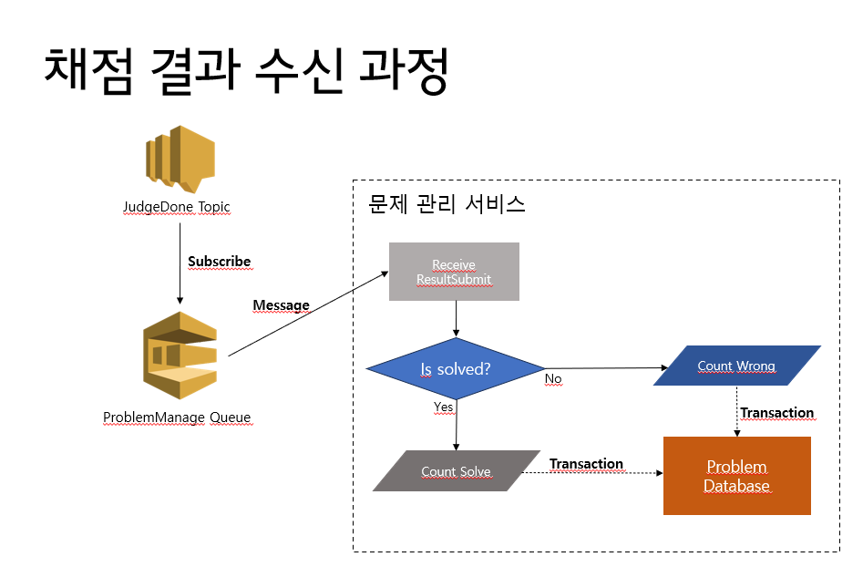
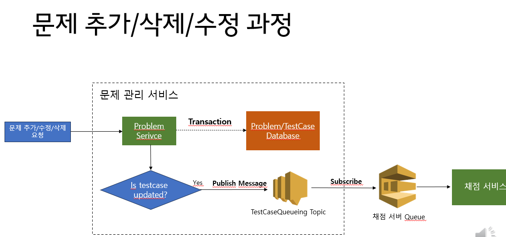
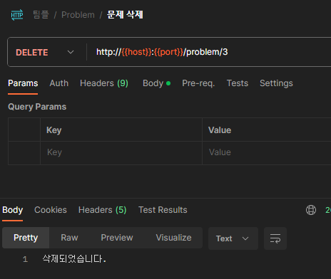
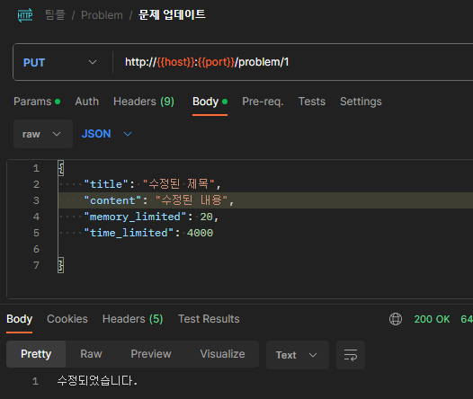
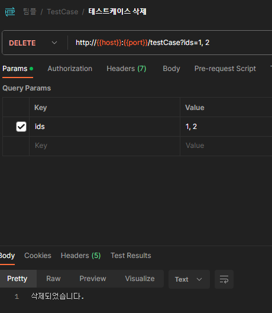
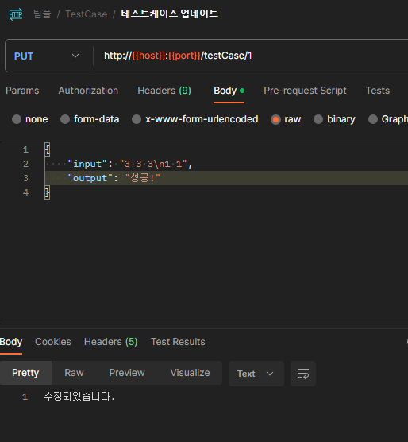

# ProblemManage
DOJ의 문제 관리 서비스입니다.

# Content
[Quick Start](#Quick-Start)

[Service Description](#Service-Description)

[DB Table](#DB-Table)

[API](#API)

[Message Form](#Message-Form)

---

# Quick Start

## 1. Git Clone
레포지토리를 클론받으시되, __"제출용"__ 브랜치를 클론받으셔야 합니다. 메인 브랜치에 서버 프로퍼티 파일이 없기 때문입니다.

## 2. Docker Image Build
본 서비스는 AWS 인프라를 사용하기 때문에 Credentials을 포함한 키값을 파라미터로 넘겨줘야 합니다.

```shell
docker build -t program_manage_service \
--build-arg access_key=<access_key> \
--build-arg secret_key=<secret_key> \
--build-arg region=<region> \
--build-arg topic_arn=<topic_arn> \
--build-arg sqs_name=<sqs_name> \
--build-arg sqs_url=<sqs_url> .
```

## 3. Docker Compose
본 서비스 이미지를 포함하여 모든 이미지가 준비되었을 때, docker compose를 통해 서비스를 올려주시면 됩니다.


# Service Description
문제와 테스트케이스를 관리하는 서비스입니다.

- 문제 및 테스케이스에 대한 기본적인 CRUD
- DOJ-TestCase-Queueing.fifo Publish
  - 토픽에 메세지를 전달하여 채점 서버의 테스트케이스 DB 동기화
- DOJ-Judge-JudgeDone.fifo Subscribe
  - 토픽을 구독하여 맞춘/틀린 횟수 동기화





---

# DB Table

## Problem Table

| key                | type | Description |
|--------------------|------|-------------|
| id(PK)             | Long | 고유키         |
| title              | Text | 문제 제목       |
| content            | Text | 문제 내용       |
| input_description  | Text | Input 설명    |
| output_description | Text | Output 설명   |
| solve_num          | int  | 맞춘 횟수       |
| wrong_num          | int  | 틀린 횟수       |
| time_limited       | int  | 시간 제한(msec) |
| memory limited     | int  | 메모리 제한(mb)  | 

## TestCase Table

| key            | type | Description |
|----------------|------|-------------|
| id(PK)         | Long | 고유키         |
| problem_id(FK) | Long | 문제 아이디      |
| input          | Text | Input 예제    |
| output         | Text | Output 예제   |

---

# API

## Problem

### 문제 추가
- Method : Post
- Rout : /problem

#### RequestBody
| key                 | type         | Description    |
|---------------------|--------------|----------------|
| title               | Text         | 문제 제목          |
| content             | Text         | 문제 내용          |
| input_description  | Text | Input 설명    |
| output_description | Text | Output 설명   |
| memory_limited      | Text         | Input 예제       |
| time_limited        | Text         | Output 예제      |
| testCaseBodyList    | TestCaseBody | 테스트 케이스 리스트    |
| TestCaseBody.input  | Text     | 입력 예제       |
| TestCaseBody.output | Text     | 출력 예제       |


#### Response
| key                | type     | Description   |
|--------------------|----------|---------------|
| title              | Text     | 문제 제목         |
| content            | Text     | 문제 내용         |
| input_description  | Text     | Input 설명      |
| output_description | Text     | Output 설명     |
| solve_num          | int      | 맞춘 횟수         |
| wrong_num          | int      | 틀린 횟수         |
| testCaseList       | TestCase | TestCase List |
| memory_limited     | Text     | Input 예제      |
| time_limited       | Text     | Output 예제     |

#### Response Example
```json
{
  "id": 18,
  "title": "제목5",
  "content": "문제 내용5",
  "input_description": "인풋 설명1",
  "output_description": "아웃풋 설명1",
  "solve_num": 0,
  "wrong_num": 0,
  "testCaseList": [
    {
      "id": 49,
      "input": "1 1 1\n1 1",
      "output": "성공!"
    },
    {
      "id": 50,
      "input": "2 2 2\n2 2",
      "output": "실패패!"
    }
  ],
  "time_limited": 100,
  "memory_limited": 100
}
```

### 문제 조회
- Method : Get
- Rout : /problem/{problemId}

#### PathVariable

| key       | type | Description |
|-----------|------|-------------|
| problemId | Long | 문제 ID       |

#### Response

| key             | type     | Description |
|-----------------|----------|-------------|
| id(PK)          | Long     | 고유키         |
| title           | Text     | 문제 제목       |
| content         | Text     | 문제 내용       |
| input_description  | Text | Input 설명    |
| output_description | Text | Output 설명   |
| memory_limited  | Text     | Input 예제    |
| time_limited    | Text     | Output 예제   |
| testCaseList    | TestCase | 테스트 케이스 리스트 |
| TestCase.id     | Long     | 입력 예제       |
| TestCase.input  | Text     | 입력 예제       |
| TestCase.output | Text     | 출력 예제       |

#### Response Example
```json
{
    "id": 18,
    "title": "제목5",
    "content": "문제 내용5",
    "input_description": "인풋 설명1",
    "output_description": "아웃풋 설명1",
    "solve_num": 0,
    "wrong_num": 0,
    "memory_limited": 100,
    "time_limited": 100,
    "testCaseList": [
        {
            "id": 49,
            "input": "1 1 1\n1 1",
            "output": "성공!"
        },
        {
            "id": 50,
            "input": "2 2 2\n2 2",
            "output": "실패패!"
        }
    ]
}
```

### 문제 Item 전체 조회
- Method : Get
- Rout : /problem/all

#### PathVariable : None

#### Response
| key             | type               | Description     |
|-----------------|--------------------|-----------------|
| ProblemItemList | List<ProblemItem\> | ProblemItem 리스트 |


#### Response Example
```json
[
    {
        "id": 1,
        "title": "제목5",
        "wrong_num": 0,
        "solve_num": 0
    }
    
]
```

### 문제 삭제
- Method : Delete
- Rout : /problem/{problemId} 

#### PathVariable

| key       | type | Description |
|-----------|------|-------------|
| problemId | Long | 문제 ID       |

- Response



### 문제 업데이트
- Method : Put
- Rout : /problem/{problemId}

#### PathVariable

| key       | type | Description |
|-----------|------|-------------|
| problemId | Long | 문제 ID       |

#### RequestBody

| key                | type  | Description   |
|--------------------|-------|---------------|
| title              | Text  | 문제 제목         |
| content            | Text  | 문제 내용        | 
| input_description  | Text  | Input 설명      |
| output_description | Text  | Output 설명     |
| memory_limited     | Text  | Input 예제      |
| time_limited       | Text  | Output 예제     |

#### Response



---

## TestCase
ProblemId를 외래키로 갖고 있는 테스트케이스 Table

### 테스트 케이스 추가
- Method : Post
- Rout : /testCase

#### RequestBody

| key                 | type         | Description     |
|---------------------|--------------|-----------------|
| problemId           | Long         | 문제 아이디          |
| testCases           | TestCaseBody | 테스트 케이스 리스트     |
| TestCaseBody.input  | Text         | 입력 예제           |
| TestCaseBody.output | Text         | 출력 예제           |

#### Response

| key               | type         | Description     |
|-------------------|--------------|-----------------|
| TestCase.id       | Long     | 입력 예제       |
| TestCase.input    | Text     | 입력 예제       |
| TestCase.output   | Text     | 출력 예제       |

### 테스크 케이스 삭제
- Method : Delete
- Rout : /testCase?ids={ids}

#### RequestParam

| key | type       | Description    |
|-----|------------|----------------|
| ids | List<Long> | 테스트 케이스 ID 리스트 |

#### Response



### 테스트 케이스 업데이트
- Method : Put
- Rout : /testCase/{testCaseId}

#### PathVariable

| key       | type | Description    |
|-----------|------|----------------|
| testCaseId | Long | 수정할 테스트 케이스 ID |

#### RequestBody

| key            | type         | Description    |
|----------------|--------------|----------------|
| input    | Text     | 입력 예제       |
| output   | Text     | 출력 예제       |

#### Response


---


# Message Form
AWS SNS - SQS 를 통해 토픽을 구독/출판하는 메세지 정보입니다.

## Publish
__TestCase -> DOJ-TestCase-Queueing.fifo__ : 
테스트케이스에 대한 변화를 해당 토픽으로 전송합니다.

- Body 형식 예시
```
// ADD
{
    "problemId": 1,
    "testCases" : [
        {
            "id": 1,
            "input": "2 2\n2 2",
            "output": "1 1 1\n1 1"
        }
    ],
    "eventType": "TestCase_ADD"
}
```

```
// UPDATE
{
    "problemId": 1,
    "testCases" : [
        {
            "id": 1,
            "input": "3 3\n3 3",
            "output": "1 1 1\n1 1"
        }
    ],
    "eventType": "TestCase_UPDATE"
}
```

```
// DELETE
{
    "problemId": 1,
    "testCases" : [
        {
            "id": 1,
            ...
        },
        {
            "id": 2,
            ...
        }
    ],
    "eventType": "TestCase_DELETE"
}
```

- EventType : 추가/삭제/업데이트인지 구분해주는 타입
```
"TestCase_ADD": testCases 추가
"TestCase_UPDATE": testCases 업데이트
"TestCase_DELETE": testCases 삭제
```

- 토픽 메세지 원본 예시
```
{
  "Type" : "Notification",
  "MessageId" : "9507b90a-235a-50d9-ad79-e4daf48a411b",
  "SequenceNumber" : "10000000000000027000",
  "TopicArn" : "arn:aws:sns:ap-northeast-2:262981387273:DOJ-TestCase-Queueing.fifo",
  "Subject" : "TestCaseQueueing",
  "Message" : "{\"problemId\":1, \"testCases\":[{\"id\":47,\"input\":\"1 1 1\\n1 1\",\"output\":\"성공!\"},{\"id\":48,\"input\":\"2 2 2\\n2 2\",\"output\":\"실패패!\"}],\"eventType\":\"TestCase_ADDED\"}",
  "Timestamp" : "2023-11-17T02:53:04.907Z",
  "UnsubscribeURL" : "https://sns.ap-northeast-2.amazonaws.com/?Action=Unsubscribe&SubscriptionArn=arn:aws:sns:ap-northeast-2:262981387273:DOJ-TestCase-Queueing.fifo:08fc981b-26eb-4fad-a258-0d0913d449a2"
}
```

## Subscribe
__DOJ-Judge-JudgeDone.fifo -> Problem__ : 채점 결과에 따라, 맞춘/틀린 횟수를 카운팅합니다.

- Body 형식 예시
```

```

- 토픽 메세지 원본 예시

TODO : README 업데이트 예정