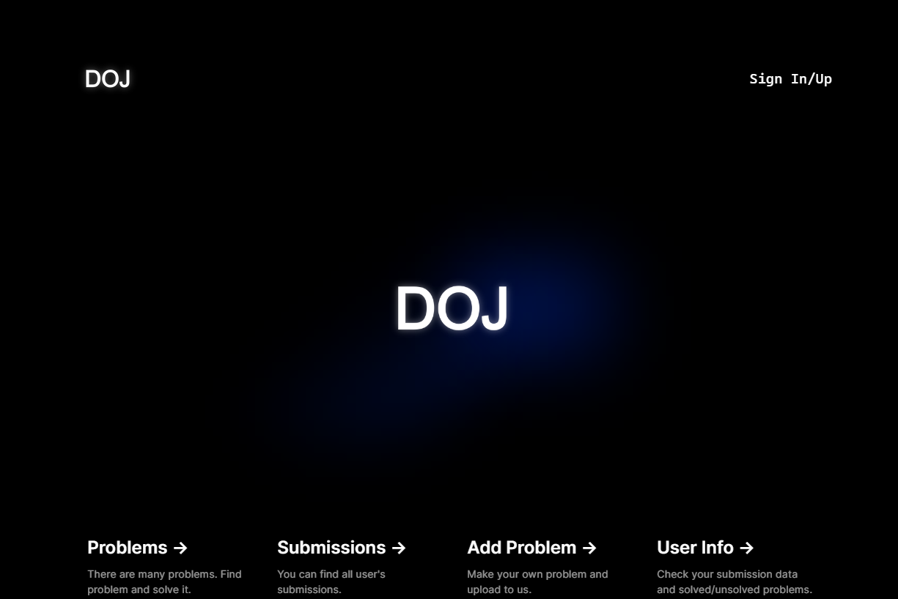

# DOJ-Docker-Online-Judge-Service
Docker로 배포하는 MSA 기반 Online Judge 서비스입니다.

# 🔍 What is DOJ?
---


DOJ는 도커 환경에서 배포되는 [Online Judge](https://www.slideshare.net/Baekjoon/ss-51001155) 서비스입니다. 온라인 저지란, 백준과 프로그래머스처럼 알고리즘 문제를 작성하고 채점을 하는 서비스입니다. MSA 기반으로 작성되었으며, 일부 AWS 인프라에 의존되어 있습니다. 

# 🤔 Why was it made?
---
온라인 저지는 알고리즘을 구현하는 실력을 연습하기에도 좋고, 기업 입사시험으로 이를 도입하는 추세이기 때문에 그 중요성이 점점 커지고 있다. 온라인 저지는 격리된 환경에서 사용자가 업로드한 소스를 실행하는 구조인데, 만약 모놀리틱한 구조로 구성될 경우 신뢰성 있는 채점을 보장하면서 서버를 확장하는데 어려움이 존재한다. 따라서 유연한 Scale-Up 과 격리된 환경을 제공할 수 있는 MSA(마이크로 서비스 아키텍처)와 컨테이너 환경을 사용해서 이를 구현하였다. 또한 개발 언어 및 프레임워크에 자유를 줌으로써 원활한 개발을 함으로써 MSA의 장점을 극대화하고자 했다.


# 🚀 Development Objectives
---

1. 알고리즘 문제와 그에 대응하는 테스트 케이스가 존재, 이들에 대한 __CRUD__ 기능 

2. 존재하는 문제 목록에서 __문제 선택, 그에 대한 풀이로 소스코드를 제출__ 기능 

3. 제출된 채점에 대해 __실시간으로 채점 현황__을 표현하는 기능

4. 제출된 채점에 대해 __소스, 에러 메시지, 걸린 시간 등 상세한 정보 확인__ 기능

# 💡DOJ Architecture
---


# 🏢 Event-Driven-Architecture


[AWS의 SNS와 SQS](https://docs.aws.amazon.com/ko_kr/sns/latest/dg/sns-common-scenarios.html)를 결합한 [Fanout Pattern](https://velog.io/@combi_jihoon/SNS-SQS-Fan-out)을 활용하여 서비스 간 데이터를 동기화시켜줍니다. 특히 채점 서버의 경우, 완전히 독립된 머신에서 구동되고 오직 구독 중인 메세지만 Pulling하여 채점을 실행합니다. 

# 🔈Microservice Descriptions
---
[사용자 서비스](https://github.com/ChaBunSI/DOJ-Docker-Online-Judge-Service/tree/main/AUTH-SERVICE)
사용자와 관련된 인증 기능을 제공하는 API서비스입니다. 로그인 기능과 사용자 정보 등을 조회할 수 있습니다.

[답안 제출 서비스](https://github.com/ChaBunSI/DOJ-Docker-Online-Judge-Service/tree/main/DOJ_ms_submission)
사용자가 작성한 답안 코드를 채점 서버에게 제출하는 API서비스입니다. 소스코드, 사용한 언어 정보 등을 메세지를 발행하여 전달합니다.

[문제 관리 서비스](https://github.com/ChaBunSI/DOJ-Docker-Online-Judge-Service/tree/main/ProblemManage)
사용자가 알고리즘 문제를 관리하는 API서비스입니다. 문제를 추가하거나 조회할 수 있습니다.

[채점 서비스](https://github.com/ChaBunSI/DOJ-Docker-Online-Judge-Service/tree/main/JUDGE-SERVICE)
[isolate](https://www.ucw.cz/moe/isolate.1.html)를 활용하여 제출된 소스코드를 문제의 테스트케이스마다 격리된 환경에서 실행시켜 답안을 검증합니다. 사용자가 실시간으로 채점 현황을 확인할 수 있도록 메세지를 발행합니다. 또한 채점이 모두 완료되었을 때 채점결과를 발행하여 데이터를 동기화시켜줍니다.

[실시간 채점 현황 서비스](https://github.com/ChaBunSI/DOJ-Docker-Online-Judge-Service/tree/main/RT-SERVICE)
채점 진행 상황을 조회하는 API 서비스입니다.

[GateWay Server](https://github.com/ChaBunSI/DOJ-Docker-Online-Judge-Service/tree/main/GATEWAY-SERVICE)
각 서비스를 라우팅해주는 Spring Cloud Gateway 서비스입니다.

[Service Discovery Server](https://github.com/ChaBunSI/DOJ-Docker-Online-Judge-Service/tree/main/DISCOVERY-SERVICE)
Gateway에서 라우팅하는 서비스를 조회하는 Spring Cloud Eureka 서비스입니다.

[Frontend](https://github.com/ChaBunSI/DOJ-Docker-Online-Judge-Service/tree/main/CLIENT-SERVICE)
사용자가 이용할 수 있는 프론트엔드 서비스입니다.

# 🎥 Demonstration Video

<iframe width="560" height="315" src="https://www.youtube.com/embed/P3XYeRZi7fc?si=mG4MGa6PPckLAiB0" title="YouTube video player" frameborder="0" allow="accelerometer; autoplay; clipboard-write; encrypted-media; gyroscope; picture-in-picture; web-share" allowfullscreen></iframe>


# 🪄 Quick Start
<details>
<summary> Quick Start</summary>

## Set AWS Infra
AWS의 SNS와 SQS를 사용하기 때문에 해당 인프라를 만들어야 합니다. 기본적으로 fifo 큐를 사용하며, 하나의 SNS 토픽에 여러 개의 SQS가 구독하고, 각 SQS는 서비스에서 메세지를 풀링하는 Fanout Pattern을 따르고 있습니다.

구성해야 하는 SNS와 SQS는 다음과 같습니다.

### SNS
- DOJ-Judge-JudgeDone.fifo

- DOJ-Submission-SubmitTask.fifo

- DOJ-TestCase-Queueing.fifo

### SQS
SNS 토픽을 구독하는 메세지 대기열 시스템입니다. 환경구성을 위해 SQS의 ARN과 URL이 필요합니다. 기본적으로 FIFO 형식이여야 합니다(ProblemManage Queue는 표준 Queue여도 가능합니다).

- __JudgeCPP.fifo__

    Sub : No Topic

    Pulled by : JudgeService(Workers)

- __JudgeNotCPP.fifo__

    Sub : No Topic

    Pulled by : JudgeService(Workers)

- __JudgeRT.fifo__

    Sub : No Topic

    Pulled by : RTService

- __JudgeTask.fifo__

    Sub : DOJ-Submission-SubmitTask

    Pulled by : JudgeService(Broker)

- __ScoreQueue.fifo__

    Sub : DOJ-TestCase-Queueing.fifo

    Pulled by : JudgeService(Broker)

- __SubmissionDone.fifo__

    Sub : DOJ-Judge-JudgeDone.fifo

    Pulled by : SubmissionService


- __ProblemManageQueue__

    Sub : DOJ-Judge-JudgeDone.fifo

    Pulled by : ProblemManage Service


## Ready For Enviornment

```build.sh```는 채점 서비스 외 모든 서비스의 이미지를, ```build_Judge.sh```는 채점 서비스의 이미지를 빌드합니다.
본 서비스는 AWS 인프라에 의존하므로 ```Access/Secret Key```와 ```SNS Topic```, ```SQS```를 사전에 생성해야 합니다.
필요한 Topic과 SQS는 다음과 같습니다

__AWS_ACCESS_KEY__ : AWS 액세스 키
__AWS_SECRET_KEY__ : AWS 시크릿 키
__SNS ARN, NAME__ : 발급한 AWS SNS의 토픽 Arn과 토픽 이름
__SQS ARN, URL__ : 생성한 AWS SQS의 Arn과 Url

## Build Docker Image through build.sh
배포할 도커 이미지를 빌드하는 실행파일입니다.
실행하기 전, __반드시 sh파일 내 환경변수를 작성해주셔야 합니다.__

__build.sh__
```bash
# AWS Keys
AWS_ACCESS_KEY=
AWS_SECRET_KEY=

# SNS Settings
DOJ_Judge_JudgeDone_name=
DOJ_Judge_JudgeDone_arn=
DOJ_Submission_SubmitTask_name=
DOJ_Submission_SubmitTask_arn=
DOJ_TestCase_Queueing_name=
DOJ_TestCase_Queueing_arn=


# SQS Settings

JudgeRT_ARN=arn:aws:sqs:
JudgeRT_URL=https://sqs.

JudgeTask_ARN=arn:aws:sqs:
JudgeTask_URL=https://sqs.

ScoreQueue_ARN=arn:aws:sqs:
ScoreQueue_URL=https://sqs.

SubmissionDone_ARN=arn:aws:sqs:
SubmissionDone_URL=https://sqs.

ProblemManageQueue_ARN=arn:aws:sqs:
ProblemManageQueue_URL=https://sqs.
...
```
채점서비스는 __브로커용 이미지__와 __워커용 이미지__를 각각 빌드해야 합니다.
__CMakeLists.txt__의 __add_executable__란에 브로커인지 워커인지 명시해줘야합니다. 아래와 같습니다

* 워커
  ```shell
  ...
  add_executable(${PROJECT_NAME} worker.cc judge_worker.h judge_aws.h judge_task.h judge_notify.h problem_manage_crud.h)
  ...
  ```

* 브로커
  ```shell
  ...
  add_executable(${PROJECT_NAME} broker.cc judge_worker.h judge_aws.h judge_task.h judge_notify.h problem_manage_crud.h)
  ...
  ```

채점 서비스의 빌드 자동화 스크립트를 ```build.sh```를 수정한 것처럼 환경변수를 기입해야 합니다.
추가로, 마지막 줄에서 도커 이미지를 빌드할 때, 워커용 이미지인지 브로커용 이미지인지 명시해야 합니다.

__build_Judge.sh__ (For Judge-Service)
```bash
# AWS Keys
AWS_ACCESS_KEY=
AWS_SECRET_KEY=

# SNS Settings
DOJ_Judge_JudgeDone_NAME=DOJ-Judge-JudgeDone.fifo
DOJ_Judge_JudgeDone_ARN=

# SQS Settings
JudgeCPP_NAME=JudgeCPP.fifo
JudgeCPP_ARN=arn:aws:sqs:
JudgeCPP_URL=https://sqs.

JudgeNotCPP_NAME=JudgeNotCPP.fifo
JudgeNotCPP_ARN=arn:aws:sqs:
JudgeNotCPP_URL=https://sqs.

JudgeRT_NAME=JudgeRT.fifo
JudgeRT_ARN=arn:aws:sqs:
JudgeRT_URL=https://sqs.

JudgeTask_NAME=JudgeTask.fifo
JudgeTask_ARN=arn:aws:sqs:
JudgeTask_URL=https://sqs.

ScoreQueue_NAME=ScoreQueue.fifo
ScoreQueue_ARN=arn:aws:sqs:
ScoreQueue_URL=https://sqs.
...

docker buildx build -t jduge_service_worker .
or..
docker buildx build -t jduge_service_broker .
```


쉘 스크립트 내용을 채웠다면, 실행시키면 됩니다.
```shell
./build.sh
./build_Judge.sh
```


## Deploy Docker container

채점 서비스 외 모든 서비스는 하나의 머신에서 배포할 수 있습니다. docker-compose를 통해 배포할 수 있습니다.
```shell
docker compose up -d
```

채점 서비스의 경우, 브로커와 워커(C/Cpp or None C/Cpp)별로 배포할 수 있습니다.
* 브로커
  ```shell
  docker run -it -d --privileged --entrypoint ./JUDGE-SERVICE -v ./testcases:/home/JUDGE-SERVICE/testcases jduge_service_broker
  ```
* 워커 (C/C++용)
  ```shell
  docker run -it -d --privileged --entrypoint ./JUDGE-SERVICE -v ./testcases:/home/JUDGE-SERVICE/testcases jduge_service_worker 1
  ```
* 워커 (C/C++ 이외)
  ```shell
  docker run -it --privileged --entrypoint ./JUDGE-SERVICE -v ./testcases:/home/JUDGE-SERVICE/testcases jduge_service_worker 0
  ```
</details>

# 

# 🔗 Dev Roles
---
| 팀원  | 역할 |
|----- |----|
| [백종원](https://github.com/onaeonae1) | 답안 제출 서비스 개발 |
| [김창엽](https://github.com/pridom1118) | 채점 서비스 개발 |
| [정우철](https://github.com/december-ok) | API Gateway & Eureka​, 사용자 서비스, 실시간 채점 현황 서비스​, Frontend 개발 |
| [강병우](https://github.com/peace0096) | 문제 관리 서비스 개발 | 
| 공통   | AWS SNS / SQS 연동 및 데이터 동기화 작업, 프로젝트 기획| 

# 🗓️ 개발 기간 및 스케쥴
---
__개발 기간 : 약 2개월__

| 제목 | 시작일 | 종료일 | 내용 |
|------|-------|-------|------|
| 프로젝트 제안서 작성| 10/23| 10/30| 프로젝트 제안서 작성 |
| API 기능 정의 및 명세서 작성 | 11/5 | 11/12 | 프로젝트 요구사항에 따른 서비스별 API 기능 정의 및 명세서 README 작성 |
| Gateway 테스트 완료  | 11/12 | 11/14 | 배포 서비스를 Spring Cloud Discovery와 Spring Cloud Gateway를 통해 API 등록 |
| 문제 및 테스트케이스 기능 초기 구현 | 11/12 | 11/19 | 초기 테스트를 위한 문제 및 테스트케이스 API 서비스 개발 |
| 제출 서비스 초기 구현 | 11/12 | 11/19 | 채점 테스트를 위한 답안 제출 서비스 개발 |
| 채점 서비스 초기 구현 | 11/12 | 11/19 | 정답/오답 구분 가능한 Cpp 채점 서비스 개발 |
| 프론트 서비스 초기 구현 | 11/12 | 11/19 | API 요청을 통해 문제 CRUD와 답안 작성, 제출 및 채점 기능 구현 |
| 인증 관련 문제 해결 | 12/1 | 12/4 | HTTP 요청에 JWT 포함 |
| 채점 기능 보완 | 12/1| 12/5 | 제출 정보에 사용한 시간 및 메모리 정보 포함 |
| 실시간 채점 현황 구현 | 12/4 | 12/10 | SQS를 통해 매 테스트케이스 채점 시 그 결과를 큐로 전달 |
| 제출 Throttling 구현 | 12/3 | 12/10 | 채점 서비스와 문제 관리 서비스간의 데이터 동기화 구현 |
| 데이터 동기화 | 12/4 | 12/15| 많은 제출이 발생하면 Redis에 기록하여 순차적으로 내보냄 |
| 채점 서비스 분리 및 컨테이너화 | 12/15 | 12/16 | 워커와 브로커로 분리 및 각각에 대한 도커 이미지 빌드 완료 |
| 채점 서비스 클라우드에 배포 | 12/15 | 12/18 | GCP에 채점 서비스 배포 완료 |

# 📜 Documents
---
[DOJ 최종보고서](https://github.com/ChaBunSI/DOJ-Docker-Online-Judge-Service/blob/main/Documents/DOJ%20%EC%B5%9C%EC%A2%85%EB%B3%B4%EA%B3%A0%EC%84%9C.pdf)

[DOJ 발표 자료](https://github.com/ChaBunSI/DOJ-Docker-Online-Judge-Service/blob/main/Documents/%EC%B5%9C%EC%A2%85%EB%B0%9C%ED%91%9C_%EB%B0%9C%ED%91%9C%EC%9E%90%EB%A3%8C.pptx)

[DOJ 발표 영상](https://youtu.be/UL-03nXUSQU)
