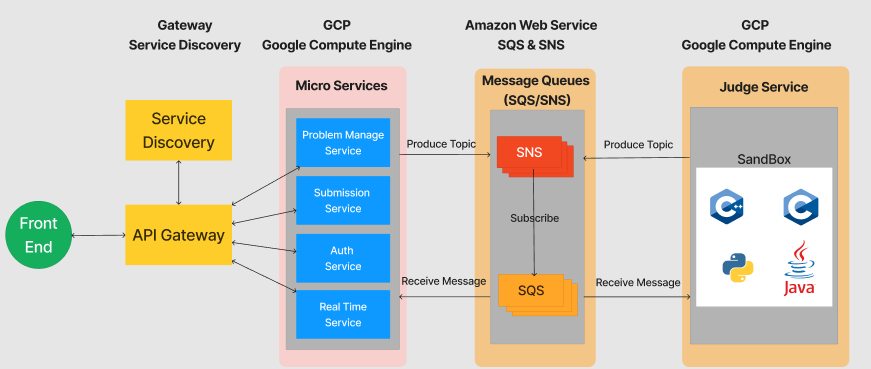
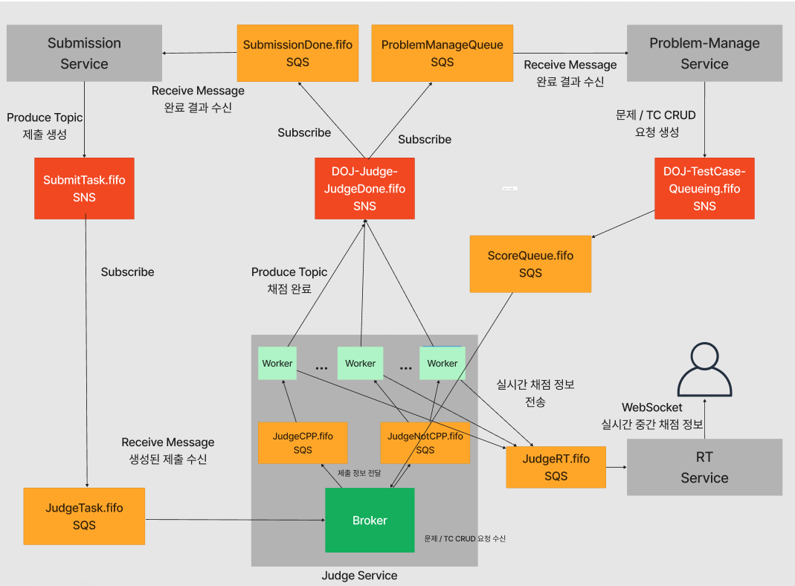

# DOJ-Docker-Online-Judge-Service
Docker로 배포하는 MSA 기반 Online Judge 서비스입니다.

# What is DOJ?
---
DOJ는 도커 환경에서 배포되는 Online Judge 서비스입니다. 온라인 저지란, 백준과 프로그래머스처럼 알고리즘 문제를 작성하고 채점을 하는 서비스입니다. MSA 기반으로 작성되었으며, 일부 AWS 인프라에 의존되어 있습니다. 

# DOJ Architecture
---


# Event-Driven-Architecture


AWS의 SNS와 SQS를 결합한 Fanout Pattern을 활용하여 서비스 간 데이터를 동기화시켜줍니다.

# Quick Start
<details>
<summary> Quick Start</summary>

## Set AWS Infra
AWS의 SNS와 SQS를 사용하기 때문에 해당 인프라를 만들어야 합니다. 기본적으로 fifo 큐를 사용하며, 하나의 SNS 토픽에 여러 개의 SQS가 구독하고, 각 SQS는 서비스에서 메세지를 풀링하는 Fanout Pattern을 따르고 있습니다.

구성해야 하는 SNS와 SQS는 다음과 같습니다.

### SNS
- DOJ-Judge-JudgeDone.fifo

- DOJ-Submission-SubmitTask.fifo

- DOJ-TestCase-Queueing.fifo

### SQS
SNS 토픽을 구독하는 메세지 대기열 시스템입니다. 환경구성을 위해 SQS의 ARN과 URL이 필요합니다. 기본적으로 FIFO 형식이여야 합니다(ProblemManage Queue는 표준 Queue여도 가능합니다).

- __JudgeCPP.fifo__

    Sub : No Topic
    
    Pulled by : JudgeService(Workers)

- __JudgeNotCPP.fifo__

    Sub : No Topic

    Pulled by : JudgeService(Workers)

- __JudgeRT.fifo__

    Sub : No Topic

    Pulled by : RTService

- __JudgeTask.fifo__

    Sub : DOJ-Submission-SubmitTask

    Pulled by : JudgeService(Broker)

- __ScoreQueue.fifo__

    Sub : DOJ-TestCase-Queueing.fifo

    Pulled by : JudgeService(Broker)

- __SubmissionDone.fifo__

    Sub : DOJ-Judge-JudgeDone.fifo

    Pulled by : SubmissionService


- __ProblemManageQueue__

    Sub : DOJ-Judge-JudgeDone.fifo

    Pulled by : ProblemManage Service


## Ready For Enviornment

```build.sh```는 채점 서비스 외 모든 서비스의 이미지를, ```build_Judge.sh```는 채점 서비스의 이미지를 빌드합니다.
본 서비스는 AWS 인프라에 의존하므로 ```Access/Secret Key```와 ```SNS Topic```, ```SQS```를 사전에 생성해야 합니다.
필요한 Topic과 SQS는 다음과 같습니다

__AWS_ACCESS_KEY__ : AWS 액세스 키
__AWS_SECRET_KEY__ : AWS 시크릿 키
__SNS ARN, NAME__ : 발급한 AWS SNS의 토픽 Arn과 토픽 이름
__SQS ARN, URL__ : 생성한 AWS SQS의 Arn과 Url

## Build Docker Image through build.sh
배포할 도커 이미지를 빌드하는 실행파일입니다.
실행하기 전, __반드시 sh파일 내 환경변수를 작성해주셔야 합니다.__

__build.sh__
```bash
# AWS Keys
AWS_ACCESS_KEY=
AWS_SECRET_KEY=

# SNS Settings
DOJ_Judge_JudgeDone_name=
DOJ_Judge_JudgeDone_arn=
DOJ_Submission_SubmitTask_name=
DOJ_Submission_SubmitTask_arn=
DOJ_TestCase_Queueing_name=
DOJ_TestCase_Queueing_arn=


# SQS Settings

JudgeRT_ARN=arn:aws:sqs:
JudgeRT_URL=https://sqs.

JudgeTask_ARN=arn:aws:sqs:
JudgeTask_URL=https://sqs.

ScoreQueue_ARN=arn:aws:sqs:
ScoreQueue_URL=https://sqs.

SubmissionDone_ARN=arn:aws:sqs:
SubmissionDone_URL=https://sqs.

ProblemManageQueue_ARN=arn:aws:sqs:
ProblemManageQueue_URL=https://sqs.
...
```
채점서비스는 __브로커용 이미지__와 __워커용 이미지__를 각각 빌드해야 합니다.
__CMakeLists.txt__의 __add_executable__란에 브로커인지 워커인지 명시해줘야합니다. 아래와 같습니다

* 워커
  ```shell
  ...
  add_executable(${PROJECT_NAME} worker.cc judge_worker.h judge_aws.h judge_task.h judge_notify.h problem_manage_crud.h)
  ...
  ```

* 브로커
  ```shell
  ...
  add_executable(${PROJECT_NAME} broker.cc judge_worker.h judge_aws.h judge_task.h judge_notify.h problem_manage_crud.h)
  ...
  ```

채점 서비스의 빌드 자동화 스크립트를 ```build.sh```를 수정한 것처럼 환경변수를 기입해야 합니다.
추가로, 마지막 줄에서 도커 이미지를 빌드할 때, 워커용 이미지인지 브로커용 이미지인지 명시해야 합니다.

__build_Judge.sh__ (For Judge-Service)
```bash
# AWS Keys
AWS_ACCESS_KEY=
AWS_SECRET_KEY=

# SNS Settings
DOJ_Judge_JudgeDone_NAME=DOJ-Judge-JudgeDone.fifo
DOJ_Judge_JudgeDone_ARN=

# SQS Settings
JudgeCPP_NAME=JudgeCPP.fifo
JudgeCPP_ARN=arn:aws:sqs:
JudgeCPP_URL=https://sqs.

JudgeNotCPP_NAME=JudgeNotCPP.fifo
JudgeNotCPP_ARN=arn:aws:sqs:
JudgeNotCPP_URL=https://sqs.

JudgeRT_NAME=JudgeRT.fifo
JudgeRT_ARN=arn:aws:sqs:
JudgeRT_URL=https://sqs.

JudgeTask_NAME=JudgeTask.fifo
JudgeTask_ARN=arn:aws:sqs:
JudgeTask_URL=https://sqs.

ScoreQueue_NAME=ScoreQueue.fifo
ScoreQueue_ARN=arn:aws:sqs:
ScoreQueue_URL=https://sqs.
...

docker buildx build -t jduge_service_worker .
or..
docker buildx build -t jduge_service_broker .
```


쉘 스크립트 내용을 채웠다면, 실행시키면 됩니다.
```shell
./build.sh
./build_Judge.sh
```


## Deploy Docker container

채점 서비스 외 모든 서비스는 하나의 머신에서 배포할 수 있습니다. docker-compose를 통해 배포할 수 있습니다.
```shell
docker compose up -d
```

채점 서비스의 경우, 브로커와 워커(C/Cpp or None C/Cpp)별로 배포할 수 있습니다.
* 브로커
  ```shell
  docker run -it -d --privileged --entrypoint ./JUDGE-SERVICE -v ./testcases:/home/JUDGE-SERVICE/testcases jduge_service_broker
  ```
* 워커 (C/C++용)
  ```shell
  docker run -it -d --privileged --entrypoint ./JUDGE-SERVICE -v ./testcases:/home/JUDGE-SERVICE/testcases jduge_service_worker 1
  ```
* 워커 (C/C++ 이외)
  ```shell
  docker run -it --privileged --entrypoint ./JUDGE-SERVICE -v ./testcases:/home/JUDGE-SERVICE/testcases jduge_service_worker 0
  ```
</details>

# Microservice Descriptions
---
사용자 서비스

답안 제출 서비스

문제 관리 서비스

채점 서비스

실시간 채점 현황 서비스

GateWay Server

Service Discovery Server

Frontend


# Dev Roles
---
| 팀원  | 역할 |
|----- |----|
| [백종원](https://github.com/onaeonae1) | 답안 제출 서비스 개발 |
| [김창엽](https://github.com/pridom1118) | 채점 서비스 개발 |
| [정우철](https://github.com/december-ok) | API Gateway & Eureka​, 사용자 서비스, 실시간 채점 현황 서비스​, Frontend 개발 |
| [강병우](https://github.com/peace0096) | 문제 관리 서비스 개발 | 
| 공통   | AWS SNS / SQS 연동 및 데이터 동기화 작업, 프로젝트 기획| 

# Documents
DOJ 최종보고서

DOJ 발표 자료

DOJ 발표 영상

---