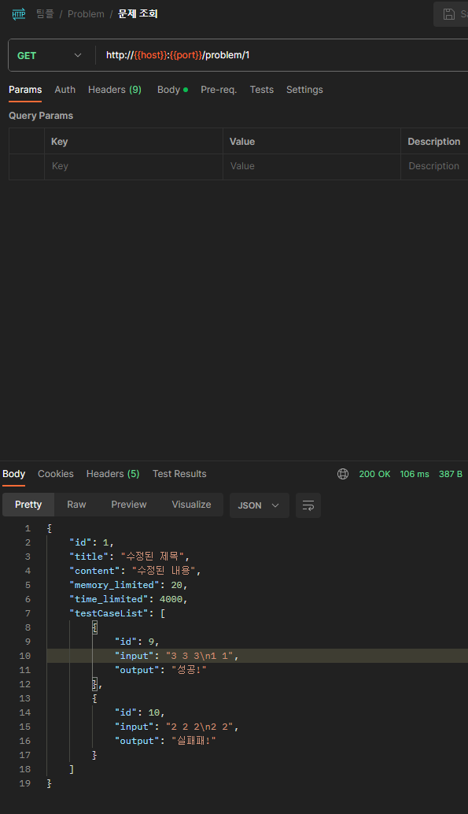

# ProblemManage
DOJ의 문제 관리 서비스입니다.

# 기능
문제 CRUD

# DB

## Problem Table
| key            | type | Description |
|----------------|------|-------------|
| id(PK)         | Long | 고유키         |
| title          | Text | 문제 제목       |
| content        | Text | 문제 내용       |
| solve_num      | int  | 맞춘 횟수       |
| wrong_num      | int  | 틀린 횟수       |
| time_limited   | int  | 시간 제한(msec) |
| memory limited | int  | 메모리 제한(mb)  | 

## TestCase Table
| key            | type | Description |
|----------------|------|-------------|
| id(PK)         | Long | 고유키         |
| problem_id(FK) | Long | 문제 아이디      |
| input          | Text | Input 예제    |
| output         | Text | Output 예제   |

# API

## Problem

### 문제 추가
- Method : Post
- Rout : /problem
- RequestBody

| key                 | type         | Description    |
|---------------------|--------------|----------------|
| title               | Text         | 문제 제목          |
| content             | Text         | 문제 내용          |
| memory_limited      | Text         | Input 예제       |
| time_limited        | Text         | Output 예제      |
| testCaseBodyList    | TestCaseBody | 테스트 케이스 리스트    |
| TestCaseBody.input  | Text     | 입력 예제       |
| TestCaseBody.output | Text     | 출력 예제       |

 - Response

| key            | type   | Description    |
|----------------|--------|----------------|
| title          | Text   | 문제 제목          |
| content        | Text   | 문제 내용          |
| solve_num      | int    | 맞춘 횟수       |
| wrong_num      | int    | 틀린 횟수       |
| memory_limited | Text   | Input 예제       |
| time_limited   | Text   | Output 예제      |

### 문제 조회
- Method : Get
- Rout : /problem/{problemId}
- PathVariable

| key       | type | Description |
|-----------|------|-------------|
| problemId | Long | 문제 ID       |

- Response

| key             | type     | Description |
|-----------------|----------|-------------|
| id(PK)          | Long     | 고유키         |
| title           | Text     | 문제 제목       |
| content         | Text     | 문제 내용       |
| memory_limited  | Text     | Input 예제    |
| time_limited    | Text     | Output 예제   |
| testCaseList    | TestCase | 테스트 케이스 리스트 |
| TestCase.id     | Long     | 입력 예제       |
| TestCase.input  | Text     | 입력 예제       |
| TestCase.output | Text     | 출력 예제       |

### 문제 Item 전체 조회
- Method : Get
- Rout : /problem/all
- PathVariable : None

- Response

### 문제 삭제
- Method : Delete
- Rout : /problem/{problemId}
- PathVariable

| key       | type | Description |
|-----------|------|-------------|
| problemId | Long | 문제 ID       |

- Response

### 문제 업데이트
- Method : Put
- Rout : /problem/{problemId}
- PathVariable

| key       | type | Description |
|-----------|------|-------------|
| problemId | Long | 문제 ID       |

- RequestBody

| key            | type         | Description    |
|----------------|--------------|----------------|
| title          | Text         | 문제 제목          |
| content        | Text         | 문제 내용          |
| memory_limited | Text         | Input 예제       |
| time_limited   | Text         | Output 예제      |

- Response

## TestCase
ProblemId를 외래키로 갖고 있는 테스트케이스 Table

### 테스트 케이스 추가
- Method : Post
- Rout : /testCase
- RequestBody

| key                 | type         | Description     |
|---------------------|--------------|-----------------|
| problemId           | Long         | 문제 아이디          |
| testCases           | TestCaseBody | 테스트 케이스 리스트     |
| TestCaseBody.input  | Text         | 입력 예제           |
| TestCaseBody.output | Text         | 출력 예제           |

- Response

| key               | type         | Description     |
|-------------------|--------------|-----------------|
| TestCase.id       | Long     | 입력 예제       |
| TestCase.input    | Text     | 입력 예제       |
| TestCase.output   | Text     | 출력 예제       |

### 테스크 케이스 삭제
- Method : Delete
- Rout : /testCase?ids={ids}
- RequestParam

| key | type       | Description    |
|-----|------------|----------------|
| ids | List<Long> | 테스트 케이스 ID 리스트 |

- Response

### 테스트 케이스 업데이트
- Method : Put
- Rout : /testCase/{testCaseId}
- PathVariable

| key       | type | Description    |
|-----------|------|----------------|
| testCaseId | Long | 수정할 테스트 케이스 ID |

- RequestBody

| key            | type         | Description    |
|----------------|--------------|----------------|
| input    | Text     | 입력 예제       |
| output   | Text     | 출력 예제       |

- Response

